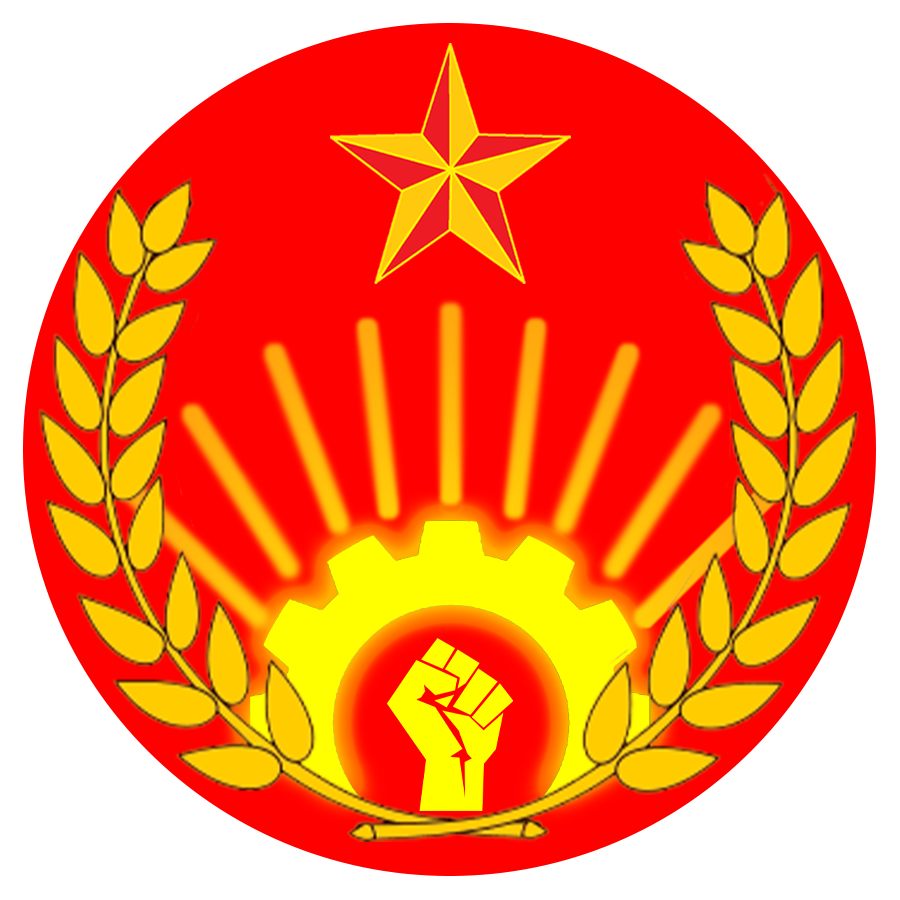

# 瑞得福人民解放阵线

> ### 马克思主义的道理，千条万绪，归根结底，就是一句话：“造反有理。” ──毛泽东

可能有人想过，但是从没有人干过。将人民的力量汇集在一起，把人民的声音发出来，提供一个可靠的渠道去宣泄不满。
当权者对权力执迷不悟，不给他一个压力他们是不会认真对待你的反馈的。我们想要做的就是成为这个“压力”，平衡他们的权力。

我们知道，这件事是非常困难的。反动派以一切方式阻挡人民的联合，因为他们知道，人民一旦联合起来，力量是不可估量的。
他们越害怕，我们就越高兴。他们越是谩骂，我们越是继续。人民的反馈是我们前进的动力，而敌人的污蔑才是我们判断是否正确的指标。

因此，我们在这里，诚恳的邀请任何一位愿意为增添瑞得福的进步左翼力量的同志们，和我们一齐，为瑞得福人民的解放奋斗。
